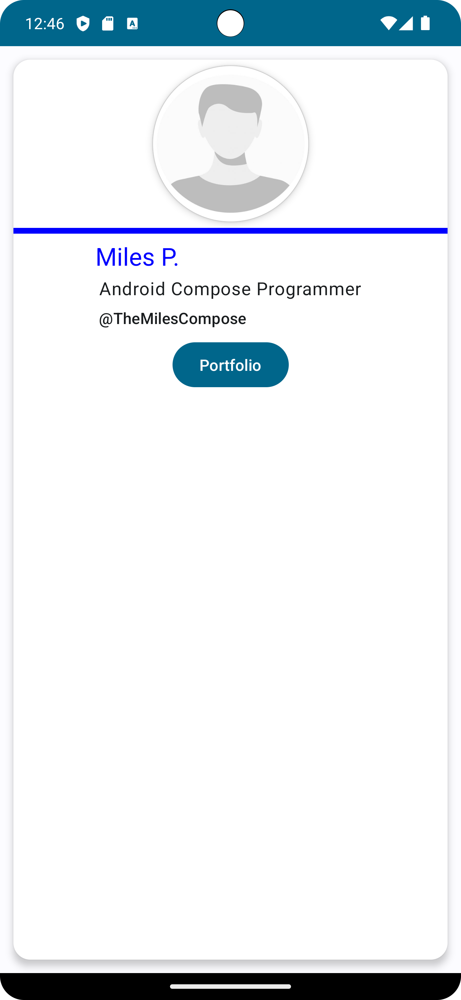
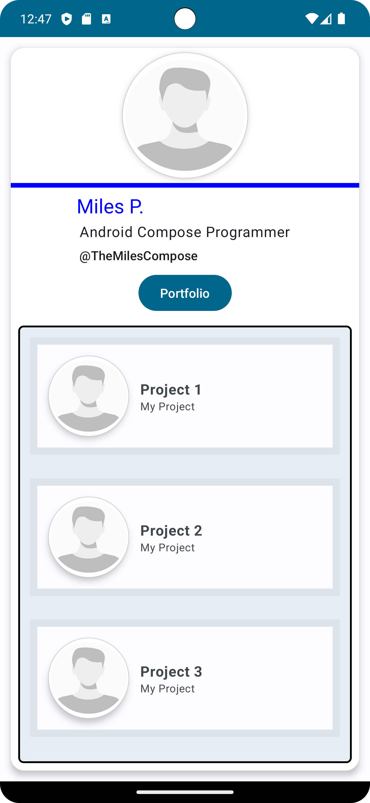
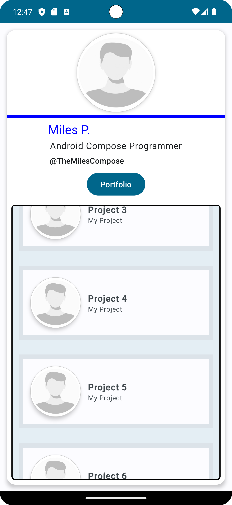

# Business Card Application with Android Jetpack Compose

This repository contains an Android application built using Jetpack Compose that serves as a digital business card.  This project was created following a course from O'Reilly Learning ([link](https://learning.oreilly.com/videos/android-jetpack-compose/9781803237718/)).


## Key Features

* **Clean and Modern UI:**  A visually appealing business card design implemented with Jetpack Compose.
* **Interactive Portfolio:** A button reveals a scrollable list of project entries.
* **High-Quality Images:** Includes a profile picture and screenshots of the app.
* **Android API 34 Compatibility:** Developed for modern Android devices.


## Technologies Used

* **Kotlin:** The primary programming language.
* **Jetpack Compose:**  Android's modern declarative UI toolkit.
* **AndroidX:**  Essential Android libraries.
* **Gradle:** Build system.


## Prerequisites

Before you begin, ensure you have the following installed:

* **Android Studio:**  The official IDE for Android development.  (Download from [developer.android.com](https://developer.android.com/studio))
* **JDK 8 or higher:** Java Development Kit.
* **Android SDK:** Android Software Development Kit, including the necessary build tools and Android API level 31 or higher.


## Installation

1. **Clone the repository:**

   ```bash
   git clone <repository_url>
   ```

2. **Open in Android Studio:** Open the cloned project in Android Studio.

3. **Sync Project:** Android Studio will automatically sync the project with Gradle.  If it doesn't, manually sync by clicking "File" -> "Sync Project with Gradle Files".

4. **Install Dependencies:**  All necessary dependencies are specified in the `app/build.gradle.kts` file. Gradle will automatically download and manage these dependencies during the build process.


## Project Structure

The project follows a standard Android structure:

```
app/
  src/
    main/             # Main source code
      java/           # Java/Kotlin source files
        com/example/myapplication/
          MainActivity.kt   # Main activity
          ui/               # UI components
            theme/          # Theme related code
              Color.kt
              Theme.kt
              Type.kt
      res/             # Resources (images, layouts, etc.)
        drawable/
        mipmap-anydpi/
        mipmap-hdpi/
        mipmap-mdpi/
        mipmap-xhdpi/
        mipmap-xxhdpi/
        mipmap-xxxhdpi/
        values/
        xml/
    androidTest/     # Android instrumentation tests
    test/             # Unit tests
  build.gradle.kts   # Module-level build file
  proguard-rules.pro # ProGuard rules
build.gradle.kts     # Project-level build file
gradle.properties   # Gradle properties
gradlew             # Gradle wrapper for Unix-like systems
gradlew.bat         # Gradle wrapper for Windows
images/             # Screenshot images
README.md           # This file
settings.gradle.kts # Project settings
```


## Usage Examples

The app is a self-contained business card.  No specific commands or inputs are required. Upon launching the app, the business card is displayed. Clicking the "Portfolio" button reveals a list of project entries.


## Configuration

The application's configuration is primarily managed through the `app/build.gradle.kts` file and `gradle.properties` file. Key configurations include:

* **`app/build.gradle.kts`:**  This file specifies the application ID, minimum SDK version, target SDK version, dependencies, and build types (release, debug).
* **`gradle.properties`:**  Contains settings for Gradle, such as JVM arguments (`org.gradle.jvmargs`).


## Scripts

* **`gradlew` (and `gradlew.bat`):** These are wrapper scripts that ensure consistent Gradle usage across different environments.  They are used to execute Gradle tasks like building, running, and testing the app.  Standard commands include:
    * `./gradlew build`: Builds the app.
    * `./gradlew run`: Runs the app on an emulator or connected device.
    * `./gradlew test`: Runs unit and instrumentation tests.

## License

### Disclaimer

This repository contains code created while following the course  
**"Android Jetpack Compose - Build Android Native UIs Fast"** by **Paulo Dichone**,  
available at: [O’Reilly Learning Platform](https://learning.oreilly.com/course/android-jetpack-compose/9781803237718/)

The content is intended for educational purposes only and closely follows the structure and lessons from the original course.

All rights to the course content and materials belong to **Paulo Dichone**.  
This repository is not affiliated with or endorsed by Paulo Dichone or O’Reilly.

If you are the content owner and would like this repository modified or removed, please contact me directly.


## Error Messages

Refer to the Android Studio error messages and logs for debugging help.  If you encounter issues, ensure your environment is correctly setup, including Java, Android SDK, and Android Studio.  Check the Gradle sync to confirm all dependencies are correctly resolved.

## Screenshots

<p align="center">

<br>
<em>Figure 1: Home Screen of the app without the portfolio.</em>
</p>

<p align="center">

<br>
<em>Figure 2: Screenshot of the app with the portfolio.</em>
</p>

<p align="center">

<br>
<em>Figure 3: Screenshot of the app with the portfolio.</em>
</p>
